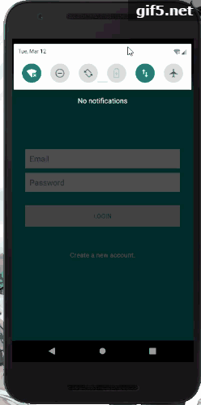

# Login
Homework for Android-app development

Thanks for Dr.Feno for the help and original app.

It's a Login implementation with sharedPreferences.

I found that "MODEL_APPEND" is not available, so you can only have one user for this app.
